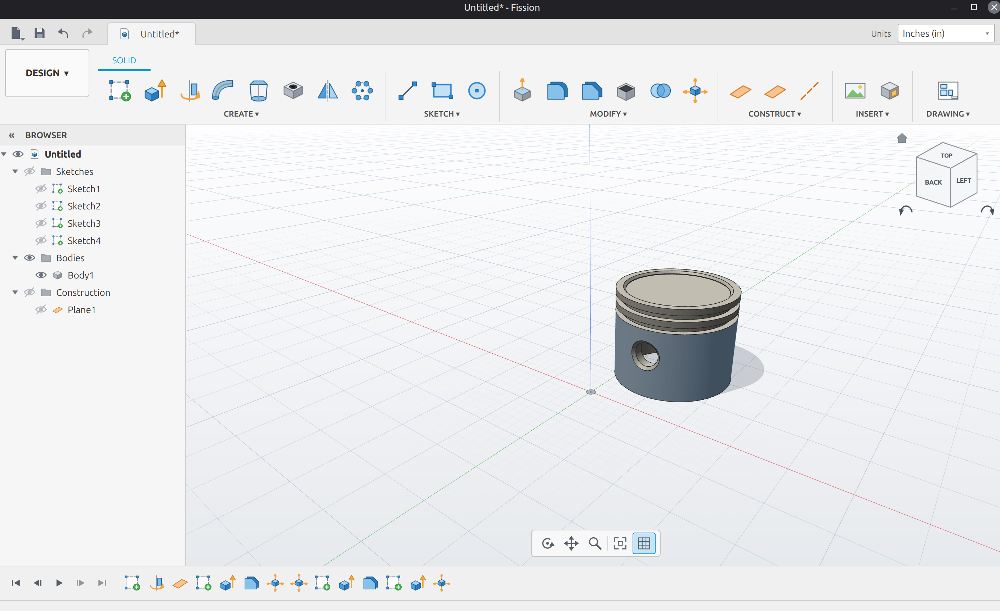

# Fission: Free 3d modeling software

## How to run

Currently you have to run linux if you wanna use Fission

### Running appimage

Easist option

1. Download AppImage from releases
2. right click --> properties --> permissions, click "Allow Executing File as Program" (or similar)
3. Double click it

From terminal

1. Download AppImage from releases
2. chmod +x fission.AppImage
3. ./fission.AppImage

### Running in python 

1. clone the project 
2. python3 -m venv venv
4. source ./venv/bin/activate
5. pip install -r requirements.txt
6. python3 fissionX.py

### Building appimage

1. clone the project 
2. python3 -m venv venv
4. source ./venv/bin/activate
5. pip install -r requirements.txt
6. ./build_appimage.sh fissionX.py

### Contributing

Contributions are welcome from anyone, submit a PR, there are likely bugs
and things that don't work as they're intended, please let me know

Currently Fission only has basic solid sketch, but surface modeling, and others
are in the works.

Has only been tried on linux mint, if other distros don't work please lmk

fission uses a bunch of open source libraries all basically bundled together
with python.

### Documentation

basically click create sketch, select a plane, draw it, and extrude.
if you want to take away material in the size of a sketch put a negative
number in while extruding.

